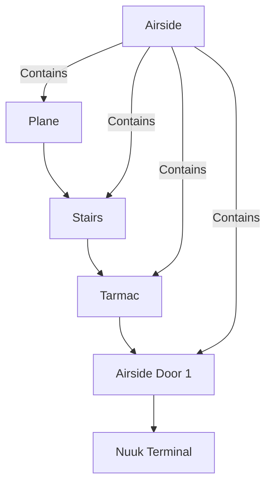
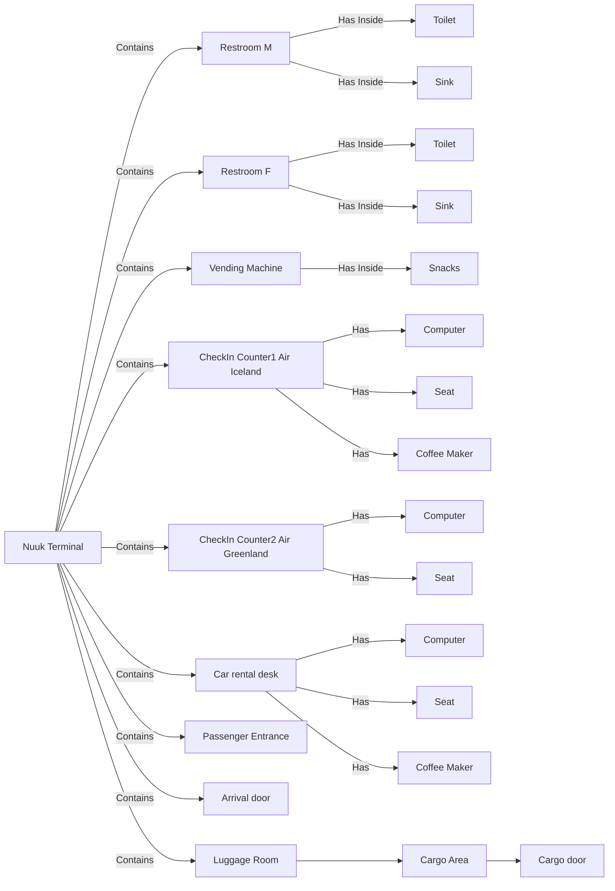
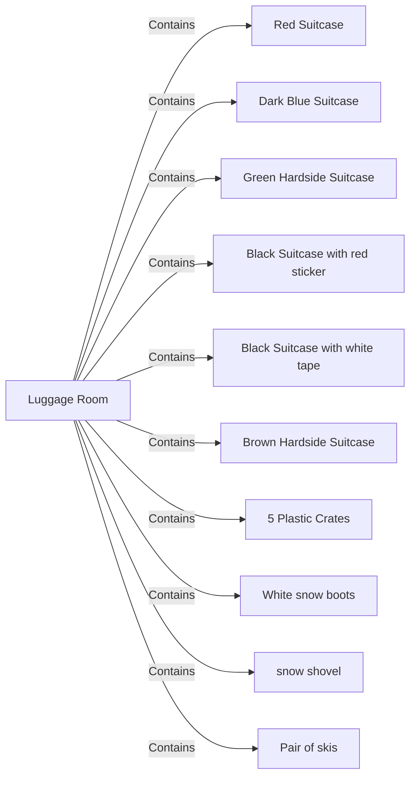
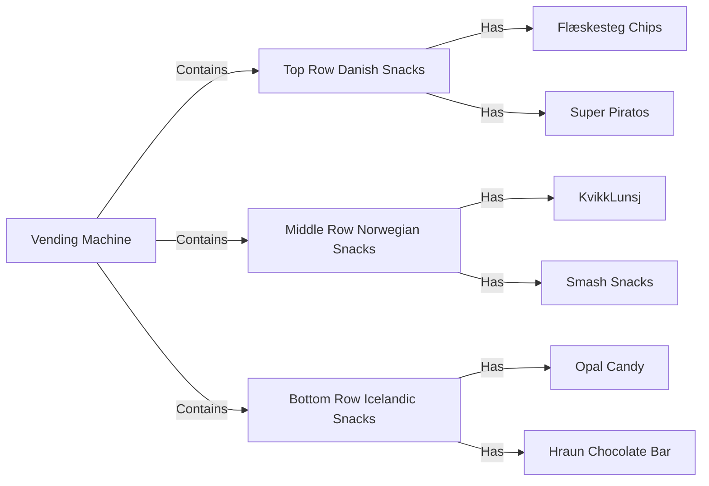
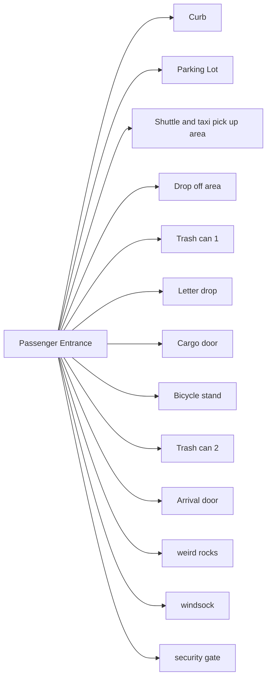
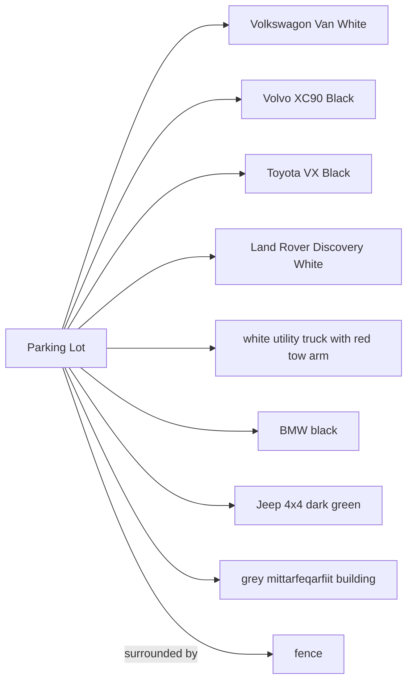

### Airside

```mermaid
graph TD
A[Airside]
    N1[Plane]  --> N2[Stairs]
    N2 --> N3[Tarmac]
    N3 --> N4[Airside Door 1]
    N4 --> N5[Nuuk Terminal]
    A -- Contains --> N1 & N2 & N3 & N4
```

---

### Nuuk Terminal

```mermaid
graph LR
A[Nuuk Terminal]
    A -- Contains --> B[Restroom M]
    A -- Contains --> C[Restroom F]
    A -- Contains --> D[Vending Machine]
    A -- Contains --> E[CheckIn Counter1 Air Iceland]
    A -- Contains --> F[CheckIn Counter2 Air Greenland]
    B -- Has Inside --> G[Toilet]
    B -- Has Inside --> H[Sink]
    C -- Has Inside --> I[Toilet]
    C -- Has Inside --> J[Sink]
    D -- Has Inside --> K[Snacks]
    E -- Has --> M[Computer]
    E -- Has --> N[Seat]
    E -- Has --> Q[Coffee Maker]
    F -- Has --> O[Computer]
    F -- Has --> P[Seat]
    A -- Contains --> Q1[Luggage Room]
    A -- Contains --> Q2[Passenger Entrance]
    A -- Contains --> Q21[Arrival door]
    A -- Contains --> Q22[Car rental desk]
    Q22 -- Has --> M22[Computer]
    Q22 -- Has --> N22[Seat]
    Q22 -- Has --> Q223[Coffee Maker]
    Q1 --> Q3[Cargo Area]
    Q3 --> Q4[Cargo door]
```

---

### Luggage Room

```mermaid
graph LR
A[Luggage Room]
    A -- Contains --> B[Red Suitcase]
    A -- Contains --> C[Dark Blue Suitcase]
    A -- Contains --> D[Green Hardside Suitcase]
    A -- Contains --> E1[Black Suitcase with red sticker]
    A -- Contains --> E2[Black Suitcase with white tape]
    A -- Contains --> F[Brown Hardside Suitcase]
    A -- Contains --> G[5 Plastic Crates]
    A -- Contains --> H[White snow boots]
    A -- Contains --> I[snow shovel]
    A -- Contains --> J[Pair of skis]
```

---

### Vending Machine

```mermaid
graph LR
A[Vending Machine]
    A -- Contains --> B[Top Row Danish Snacks]
    A -- Contains --> C[Middle Row Norwegian Snacks]
    A -- Contains --> D[Bottom Row Icelandic Snacks]
    B -- Has --> E[Flæskesteg Chips]
    B -- Has --> F[Super Piratos]
    C -- Has --> G[KvikkLunsj]
    C -- Has --> H[Smash Snacks]
    D -- Has --> I[Opal Candy]
    D -- Has --> J[Hraun Chocolate Bar]
```

---

### Passenger Entrance

```mermaid
graph LR
A[Passenger Entrance]
    A --> Curb
    A --> B[Parking Lot]
    A --> B2[Shuttle and taxi pick up area]
    A --> B3[Drop off area]
    A --> B4[Trash can 1]
    A --> C[Letter drop]
    A --> D[Cargo door]
    A --> d2[Bicycle stand]
    A --> d3[Trash can 2]
    A --> E[Arrival door]
    A --> G[weird rocks]
    A --> H[windsock]
    A --> I[security gate]
```

---

### Parking Lot

```mermaid
graph LR
A[Parking Lot]
    A --> C1[Volkswagon Van White]
    A --> E[Volvo XC90 Black]
    A --> E2[Toyota VX Black]
    A --> G[Land Rover Discovery White]
    A --> G2[white utility truck with red tow arm]
    A --> G3[BMW black]
    A --> G4[Jeep 4x4 dark green]
    A --> B[grey mittarfeqarfiit building]
    A -- surrounded by --> fence
```
